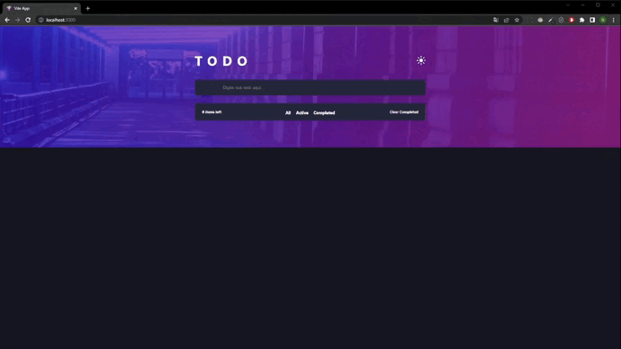

<br/>

# ToDo App  - Front end Mentor
Escolhi esse desafio por se tratar justamente de uma ToDo List 
da qual que eu julgava mais completa e que eu mesmo não sabia 
como fazer determinadas funcionalidades, aprendi uma serie de 
hooks diferentes nesse processo, como useReducer, useContext, 
useMemo, useCallback e useEffect, com um grau de complexidade e 
entendimento melhor do que apenas em um projeto de estudos.


## Stack utilizada

SCSS, REACT
<br/>


## Demonstração:



<br/><br/>

## Instalação e execução

Instale my-project com npm

```bash
  npm install toDo-App
  cd my-project
```

Execute o projeto com:
```bash
npm run dev
```    